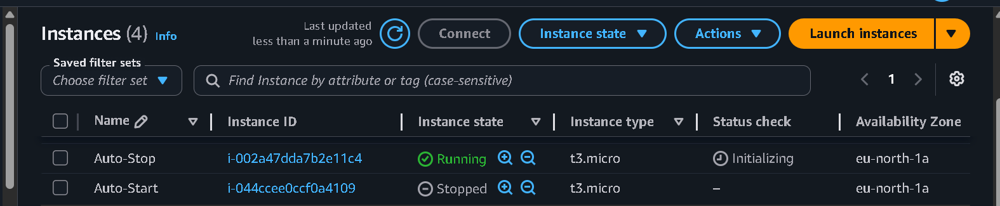
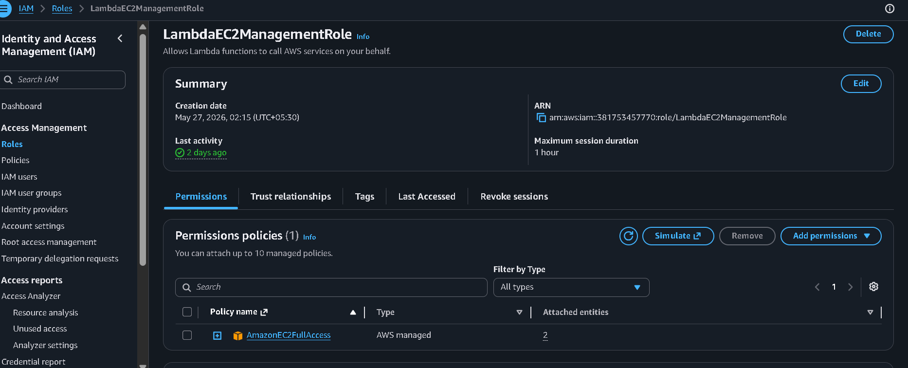
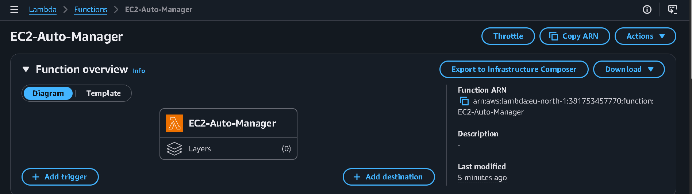

# AWS Boto3 Automation: EC2 Lifecycle Management

This repository contains Python Boto3 scripts deployed on AWS Lambda to automate the starting and stopping of EC2 instances based on resource tags.

## 📂 Repository Structure

*   **`assignment-1/`**: Lambda function to automatically stop/start EC2 instances based on tags.
*   **`assignment-2/`**: Lambda function for Assignment 2.
*   **`screenshots/`**: Visual verification of AWS environment setup and execution.

---

## 🛠️ Step 1: EC2 Instance Setup

To test this automation, two EC2 instances are configured in the AWS Management Console with specific resource tags:

1.  **Instance 1 (Auto-Stop Target)**
    *   **Name**: `Auto-Stop`
    *   **Instance type**: `t3.micro`
    *   **Tag**: Key = `Action`, Value = `Auto-Stop`
    *   **Initial State**: `Running`

2.  **Instance 2 (Auto-Start Target)**
    *   **Name**: `Auto-Start`
    *   **Instance type**: `t3.micro`
    *   **Tag**: Key = `Action`, Value = `Auto-Start`
    *   **Initial State**: `Stopped`

---

## 🔐 Step 2: Create IAM Role for Lambda

To allow the Lambda function to interact with your EC2 instances, an IAM Execution Role must be configured:

1.  **Trusted Entity**: AWS Service (`Lambda`)
2.  **Permissions Policy**: `AmazonEC2FullAccess`
3.  **Role Name**: `LambdaEC2ManagementRole`

---

## 🚀 Step 3: Create the Lambda Function

A Lambda function is created to execute the Python Boto3 script:

1.  **Function Name**: `EC2-Tag-Manager`
2.  **Runtime**: `Python 3.x`
3.  **Execution Role**: Use the existing `LambdaEC2ManagementRole` created in Step 2.

---

## 📸 Deployment Screenshots

### EC2 Dashboard Setup
Below is the verification screenshot showing both target EC2 instances in their correct initial states before running the automation script.

### IAM Role Verification
Below is the verification screenshot showing the `LambdaEC2ManagementRole` successfully created with the `AmazonEC2FullAccess` policy attached.

### Lambda Function Setup
Below is the verification screenshot showing the `EC2-Tag-Manager` Lambda function dashboard.

