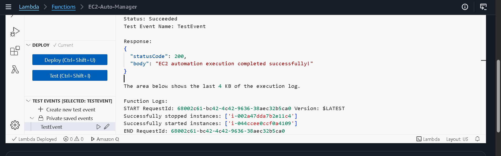
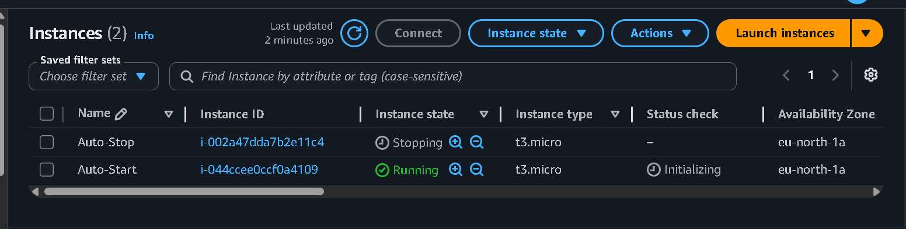
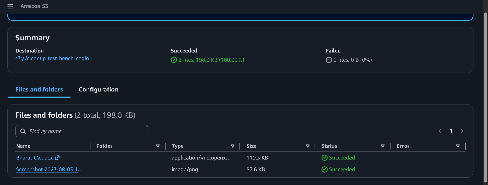
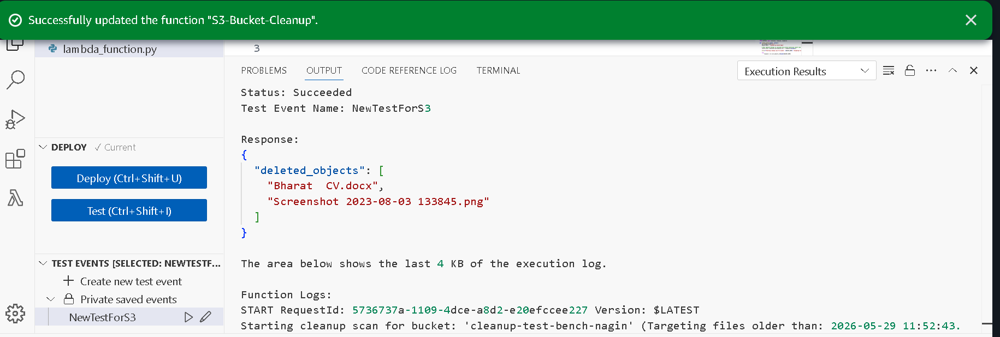

# AWS Boto3 Automation: EC2 Lifecycle Management

This repository contains Python Boto3 scripts deployed on AWS Lambda to automate the starting and stopping of EC2 instances based on resource tags.

## 📂 Repository Structure

*   **`assignment-1/`**: Lambda function to automatically stop/start EC2 instances based on tags.
*   **`assignment-2/`**: Contains `s3_cleanup_lambda.py` to automatically clean up old files in an S3 bucket.
*   **`screenshots/`**: Visual verification of AWS environment setup and execution.

---

## 🛠️ Step 1: EC2 Instance Setup

To test this automation, two EC2 instances are configured in the AWS Management Console with specific resource tags:

1.  **Instance 1 (Auto-Stop Target)**
    *   **Name**: `Auto-Stop`
    *   **Instance type**: `t3.micro`
    *   **Tag**: Key = `Action`, Value = `Auto-Stop`
    *   **Initial State**: `Running`

2.  **Instance 2 (Auto-Start Target)**
    *   **Name**: `Auto-Start`
    *   **Instance type**: `t3.micro`
    *   **Tag**: Key = `Action`, Value = `Auto-Start`
    *   **Initial State**: `Stopped`

---

## 🔐 Step 2: Create IAM Role for Lambda

To allow the Lambda function to interact with your EC2 instances, an IAM Execution Role must be configured:

1.  **Trusted Entity**: AWS Service (`Lambda`)
2.  **Permissions Policy**: `AmazonEC2FullAccess`
3.  **Role Name**: `LambdaEC2ManagementRole`

---

## 🚀 Step 3: Create the AWS Lambda Function

A Lambda function is configured to execute the Python Boto3 automation script:

1.  **Function Name**: `EC2-Auto-Manager`
2.  **Runtime**: `Python 3.14`
3.  **Execution Role**: `LambdaEC2ManagementRole` (Selected via Custom execution role settings)

---

## 📸 Deployment Screenshots

### EC2 Dashboard Setup
Below is the verification screenshot showing both target EC2 instances in their correct initial states before running the automation script.

### IAM Role Verification
Below is the verification screenshot showing the `LambdaEC2ManagementRole` successfully created with the `AmazonEC2FullAccess` policy attached.

### Lambda Function Creation List
Below is the verification screenshot confirming the successful initialization of the `EC2-Auto-Manager` function within the AWS console environment.

---

## 💻 Step 4: Write the Boto3 Python Code

The Lambda function logic is implemented using Python and Boto3 inside `assignment-1/lambda_function.py`. The script uses target resource filters to inspect the cloud environment, identify instances based on their `Action` tags, and adjust their running state safely.
---

## 🧪 Step 5: Testing & Execution Results

The Lambda function was manually triggered using a default mock test event configuration. The function executed successfully within the adjusted timeout constraints.

### 📸 Execution Result Screenshot
Below is the verification screenshot displaying the successful status response from the AWS Lambda testing panel.

# AWS Boto3 Automation Portfolio

This repository contains Python Boto3 scripts deployed on AWS Lambda to automate cloud infrastructure tasks including EC2 Lifecycle Management and automated S3 storage cleanup.

## 📂 Repository Structure

*   **`assignment-1/`**: Lambda function to automatically stop/start EC2 instances based on tags.
*   **`assignment-2/`**: Lambda function to automatically clean up old files in an S3 bucket.
*   **`screenshots/`**: Visual verification of AWS environment setup, configurations, and execution logs.

---

## 🛠️ Assignment 1 - Step 1: EC2 Instance Setup

To test this automation, two EC2 instances are configured in the AWS Management Console with specific resource tags:

1.  **Instance 1 (Auto-Stop Target)**
    *   **Name**: `Auto-Stop`
    *   **Instance type**: `t3.micro`
    *   **Tag**: Key = `Action`, Value = `Auto-Stop`
    *   **Initial State**: `Running`

2.  **Instance 2 (Auto-Start Target)**
    *   **Name**: `Auto-Start`
    *   **Instance type**: `t3.micro`
    *   **Tag**: Key = `Action`, Value = `Auto-Start`
    *   **Initial State**: `Stopped`

---

## 🔐 Assignment 1 - Step 2: Create IAM Role for Lambda

To allow the Lambda function to interact with your EC2 instances, an IAM Execution Role must be configured:

1.  **Trusted Entity**: AWS Service (`Lambda`)
2.  **Permissions Policy**: `AmazonEC2FullAccess`
3.  **Role Name**: `LambdaEC2ManagementRole`

---

## 🚀 Assignment 1 - Step 3: Create the AWS Lambda Function

A Lambda function is configured to execute the Python Boto3 automation script:

1.  **Function Name**: `EC2-Auto-Manager`
2.  **Runtime**: `Python 3.14`
3.  **Execution Role**: `LambdaEC2ManagementRole` (Selected via Custom execution role settings)

---

## 💻 Assignment 1 - Step 4: Write the Boto3 Python Code

The Lambda function logic is implemented using Python and Boto3 inside `assignment-1/lambda_function.py`. The script uses target resource filters to inspect the cloud environment, identify instances based on their `Action` tags, and adjust their running state safely.

---

## 🧪 Assignment 1 - Step 5: Testing & Execution Results

The Lambda function was manually triggered using a default mock test event configuration. The function executed successfully within the adjusted timeout constraints.

---

# 🪣 Assignment 2: Automated S3 Bucket Cleanup

This section documents an automated serverless script running on AWS Lambda using Boto3 to automatically sweep an S3 bucket and permanently delete object files using a custom retention lifecycle policy.

## 🛠️ Assignment 2 - Step 1: S3 Bucket Setup
A dedicated object storage bucket is provisioned within the AWS Console:
1.  **Bucket Architecture**: Created a globally unique S3 storage bucket named `cleanup-test-bench-nagin`.
2.  **Object Seeding**: Uploaded multiple testing files with timestamps visible.

## 🔐 Assignment 2 - Step 2: Lambda IAM Role Configuration
An execution role is built to grant secure access permissions explicitly scoped to object storage lifecycles:
1.  **Trusted Entity**: AWS Service (`Lambda`)
2.  **Permissions Policy**: `AmazonS3FullAccess`
3.  **Role Name**: `LambdaS3CleanupRole`

## 🚀 Assignment 2 - Step 3: Create the AWS Lambda Function
A secondary Lambda function is deployed to monitor object states and execute pruning operations:
1.  **Function Name**: `S3-Old-File-Cleanup`
2.  **Runtime Workspace**: `Python 3.12`
3.  **Execution Role**: Configured using `LambdaS3CleanupRole`.

## 💻 Assignment 2 - Step 4: Write and Deploy the Code
The source code is saved inside `assignment-2/s3_cleanup_lambda.py`. The script evaluates files using a `TESTING_MODE` toggle to immediately process elements and clean up resources.

## 🧪 Assignment 2 - Step 5: Manual Invocation & Verification
The function was manually triggered using an `S3Test` mock event profile. The runtime cleared out all testing elements successfully.

## 📸 Deployment Screenshots Portfolio

### [Assignment 1] EC2 Dashboard Setup

### [Assignment 1] IAM Role Verification

### [Assignment 1] Lambda Function Creation List

### [Assignment 1] Lambda Test Success

### [Assignment 1] EC2 Instances Post-Execution State

---

### [Assignment 2] S3 Bucket Inventory Baseline
Below is the verification snapshot showing the created S3 storage bucket and its initial object inventory layout.

### [Assignment 2] S3 Purge Execution Success Logs
Below is the verification screenshot confirming successful script invocation and the resulting logs listing deleted items.

